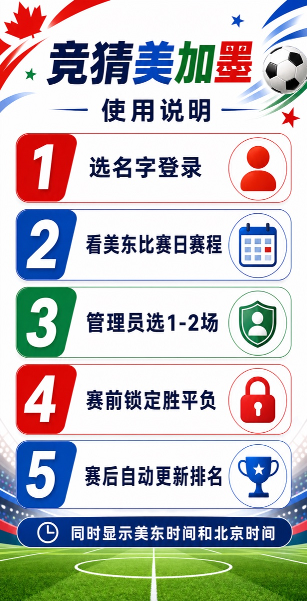

# 竞猜美加墨发布上线图文说明

目标：把本地网页应用发布到公网，让 7 位朋友用手机浏览器登录、竞猜、查看排名，并由梁东旭管理每日竞猜场次和赛果兜底。



## 1. 上线后的使用流程

1. 朋友打开网址，选择自己的名字并输入口令。
2. 首页显示当前美东比赛日完整赛程，同时显示北京时间。
3. 梁东旭在第一场开赛前选择 1 到 2 场竞猜比赛。
4. 每个人赛前选择胜、平、负；锁定后不能修改。
5. 比赛结束后更新赛果，排名自动重新计算。

## 2. 你需要准备什么

| 项目 | 用途 | 建议 |
| --- | --- | --- |
| Supabase 账号 | 数据库、登录、实时同步 | 先用免费项目即可 |
| Vercel 账号 | 发布网页 | 建议用 GitHub 登录 |
| GitHub 仓库 | 存放代码并连接 Vercel | 私有仓库也可以 |
| Dai Dai 音频 | 背景音乐 | 放到 `public/audio/dai-dai.m4a` |
| 锁定音效 | 竞猜锁定提示音 | 放到 `public/audio/lock.mp3` |
| 赛程数据 | 初始化 104 场比赛 | 以 FIFA 官方页面核对后导入 Supabase |

## 3. 创建 Supabase 后端

1. 打开 `https://supabase.com`，创建一个新项目。
2. 进入项目后，打开左侧 `SQL Editor`。
3. 复制项目里的 `supabase/migrations/001_initial_schema.sql` 全部内容，粘贴并运行。
4. 确认数据库里出现 `profiles`、`matches`、`picks`、`featured_matches`、`result_overrides`。
5. 确认 Realtime 已包含 `matches`、`picks`、`featured_matches`。

管理员权限：梁东旭的 `profiles.is_admin` 必须设置为 `true`。

## 4. 创建 7 个登录账号

在 Supabase 左侧打开 `Authentication -> Users`，为 7 位朋友分别创建用户。

| 显示名 | 登录邮箱 | 管理员 |
| --- | --- | --- |
| 王森 | `wang-sen@jingcai.local` | 否 |
| 杨宇恒 | `yang-yuheng@jingcai.local` | 否 |
| 于洋 | `yu-yang@jingcai.local` | 否 |
| 王晓明 | `wang-xiaoming@jingcai.local` | 否 |
| 毕艺馨 | `bi-yixin@jingcai.local` | 否 |
| 赵文宣 | `zhao-wenxuan@jingcai.local` | 否 |
| 梁东旭 | `liang-dongxu@jingcai.local` | 是 |

创建 Auth 用户后，把每个用户的 UUID 插入 `profiles`。

```sql
insert into public.profiles (id, display_name, is_admin)
values
  ('这里填王森的Auth UUID', '王森', false),
  ('这里填梁东旭的Auth UUID', '梁东旭', true);
```

## 5. 导入赛程和配置同步

1. 打开 FIFA 官方赛程页面：`https://www.fifa.com/en/tournaments/mens/worldcup/canadamexicousa2026/scores-fixtures?country=US&wtw-filter=ALL`
2. 把 104 场比赛按官方页面核对后导入 `matches`。
3. 比赛日按美东时间组织；开球时间建议保存成带时区的 ISO 时间，例如 `2026-06-11T15:00:00-04:00`。
4. 淘汰赛球队暂未确定时，可以先写 `待定 1A`、`待定 2B` 这类名称。
5. 球队确定后，自动同步应更新 `home_team` 和 `away_team`；如果同步慢，梁东旭可在页面手动点“更新球队”。

重要：第三方数据源只能作为辅助，不能覆盖 FIFA 官方赛程。

## 6. 配置 Vercel 发布网页

1. 把项目上传到 GitHub 仓库。
2. 打开 `https://vercel.com`，选择 `Add New Project`。
3. 选择这个 GitHub 仓库。
4. Framework Preset 选择 `Vite`。
5. Build Command 使用 `npm run build`。
6. Output Directory 使用 `dist`。
7. 添加环境变量后点击 Deploy。

| 环境变量 | 值 |
| --- | --- |
| `VITE_SUPABASE_URL` | Supabase Project URL |
| `VITE_SUPABASE_ANON_KEY` | Supabase anon public key |
| `VITE_DEMO_MODE` | `false` |
| `VITE_APP_TZ` | `Asia/Shanghai` |

## 7. 放入音乐和音效

1. 把你合法可用的 Dai Dai 音频放到 `public/audio/dai-dai.m4a`。
2. 把锁定音效放到 `public/audio/lock.mp3`。
3. 重新部署 Vercel。
4. 手机浏览器一般不允许自动播放，所以用户需要点右上角音乐按钮开启。

## 8. 上线前验收清单

- 7 个账号都能登录。
- 梁东旭显示为管理员。
- 首页显示当前美东比赛日。
- 赛程同时显示美东时间和北京时间。
- 管理员能选择 1 到 2 场竞猜比赛。
- 普通用户不能选择竞猜场次。
- 每人同一场只能锁定一次。
- 锁定后不能修改。
- 排名能根据赛果变化。
- 淘汰赛待定球队能被更新。
- FIFA 官方赛程链接能打开。
- iPhone Safari 和 Android Chrome 都能正常访问。

## 9. 比赛日运维方式

1. 每天第一场比赛开始前，梁东旭打开应用。
2. 查看当前美东比赛日完整赛程。
3. 选择 1 到 2 场作为竞猜比赛。
4. 通知朋友们在单场开赛前完成选择。
5. 比赛结束后确认赛果同步。如果没有同步，管理员手动修正赛果。
6. 淘汰赛阶段如果出现“待定”，在 FIFA 确认对阵后立刻更新球队名。
